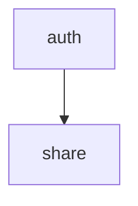

# アーキテクチャ設計

本プロジェクトは、モダンな設計手法とパターンを取り入れたECサイトのバックエンドシステムです。このドキュメントでは、採用されているアーキテクチャの主要な特徴と設計思想について説明します。

## 基本方針

システムは以下の要素を基盤とした構成を採用しています：

- **オニオンアーキテクチャ**: ドメインモデルを中心に置き、外側の層が内側の層に依存するアーキテクチャ
- **モジュラーモノリス**: Spring Modulithを利用した境界づけられたコンテクスト
- **リアクティブプログラミング**: Spring WebFluxによる非同期処理
- **イベント駆動型アーキテクチャ**: （将来的な拡張ポイント）システムの状態変更をイベントとして表現

## アーキテクチャの全体像

```mermaid
graph TD
    A[Client] --> B(Interfaces: Controller/Handler);
    B --> C{Application: Usecase};
    C --> E{Application: Workflow};
    E --> F[Domain: Model (Entity/VO)];
    C --> G[Infrastructure: Repository Impl];
    G --> H[(Database: MongoDB)];
    E --> RepIF[Domain: Repository Interface];
    C --> SecIF[Domain: Security Interface (e.g., PasswordEncoder)];
    C --> SecImpl[Infrastructure: Security Impl];
    J[Infrastructure: Configuration] -- configures --> B;
    J -- configures --> C;
    J -- configures --> G;
    J -- configures --> SecImpl;
    B --> K[DTO];
    RepIF -- implemented by --> G;
    SecIF -- implemented by --> SecImpl;
```
*(図は簡略化されています)*

## リング構造

システムはオニオンアーキテクチャに基づき、以下の3つの主要リングで構成されています：

### 1. Domain リング (中心)

ビジネスロジックの中核を担います。

- **エンティティ/集約**: ビジネスオブジェクトとそのライフサイクル (例: `Account`)。
- **値オブジェクト**: 変更不可能なビジネス値 (例: `Email`, `JsonWebToken`, `AccountId`)。
- **リポジトリインターフェース**: データ永続化の抽象化 (例: `Accounts`)。
- **ドメインイベント**: （将来的な拡張ポイント）ドメインの状態変更を表すイベント。

### 2. Application リング (中間)

アプリケーションのユースケースとワークフローを実装します。

- **Usecaseクラス**: 各機能のビジネスロジックを調整・実行 (例: `LoginUsecase`, `SignupUsecase`)。
- **Workflowインターフェース**: ビジネスプロセスのフロー定義 (例: `LoginWorkflow`, `SignupWorkflow`)。
- **ステップ定義**: 各ワークフローで実行される個別ステップのインターフェース (例: `FindAccountByEmailStep`, `VerifyWithPasswordStep`)。
- **トランザクション境界**: (MongoDBの限定的なトランザクション機能を利用する場合) データの一貫性を保証。

### 3. Infrastructure リング (外側)

技術的な詳細を実装します。

- **REST API ハンドラー/コントローラー**: クライアントからのHTTPリクエストを受け取り、レスポンスを返す (例: `LoginWithEmailHandler`)
- **バリデーション**: 入力データの検証 (`jakarta.validation` アノテーションなど)。
- **リポジトリ実装**: データアクセスロジック (例: `MongoAccounts`)。Spring Data MongoDB Reactive を利用。
- **ドキュメントモデル**: データベースのスキーマに対応するクラス (例: `AccountDocument`)。
- **ワークフロー実装**: アプリケーション層のワークフローインターフェースの実装 (例: `LoginWorkflowImpl`, `SignupWorkflowImpl`)。
- **ステップ実装**: ワークフロー内の各ステップインターフェースの実装 (例: `FindAccountByEmailStepImpl`)。
- **セキュリティ実装**: 認証・認可のメカニズム (例: `JsonWebTokenProvider`, `VerifyWithPasswordStepImpl` での `PasswordEncoder` 利用)。
- **外部サービス連携**: （将来的な拡張ポイント）決済サービスなどの外部APIとの連携。
- **設定**: アプリケーション全体の設定 (`JWTProperties` など)。

## モジュール構成

システムは機能的な関心事に基づいて以下のモジュールに分割されています：

1.  **auth**: ユーザー認証、アカウント管理
2.  **share**: 複数モジュールで共有されるコンポーネントやユーティリティ

各モジュールは独自の責務を持ち、明確に定義された境界を持っています。モジュール間の依存関係は`package-info.java`ファイルで定義され、循環依存を避けるように設計されています。

## 依存・参照関係

モジュール間の主要な依存関係は以下の通りです：


*   `auth` モジュールは `share` モジュールで定義された共通コンポーネント（例: `Email`, `DomainException`, `JsonWebTokenProvider`）を利用します。
*   `share` モジュールは他のモジュールに依存しません。

## リアクティブプログラミングモデル

本システムはSpring WebFluxを採用し、以下の特徴を持つリアクティブプログラミングモデルを実装しています：

- **非ブロッキングI/O**: Netty を利用し、スレッドリソースを効率的に利用。
- **バックプレッシャー**: データ処理のフロー制御。
- **宣言的プログラミング**: データフローの宣言的な表現。
- **リアクティブストリーム**: Project Reactor の `Mono` と `Flux` を用いた非同期データストリーム。リポジトリ層からコントローラー層まで一貫してリアクティブ型を使用。

## セキュリティモデル

システムのセキュリティは以下の要素で構成されています：

- **認証**: JWT (JSON Web Token) ベースの認証。`JsonWebTokenProvider` で生成・検証。
- **認可**: （基本的な設定のみ、詳細なRBACは未実装）Spring Security によるリクエストパスごとのアクセス制御。
- **セキュアなパスワードハンドリング**: `PasswordEncoder` (デフォルトでは BCrypt) によるパスワードのハッシュ化と比較 (`VerifyWithPasswordStepImpl` で使用)。
- **CSRFトークン**: （Stateless JWT認証のため、通常は不要）WebFlux のデフォルト設定では有効になっている可能性があるが、明示的な利用はしていない。

## まとめ

本アーキテクチャは、オニオンアーキテクチャとモジュラーモノリスの原則に基づき、ドメインモデルを中心に置き、外側のリングが内側のリングに依存する構造を採用しています。これにより、ビジネスロジックの独立性を確保しつつ、リアクティブプログラミングによるスケーラビリティと保守性を実現しています。ドメイン駆動設計の考え方を取り入れ、ビジネスの複雑さを効果的にモデル化しながら、技術的な実装の詳細との結合を最小限に抑えています。