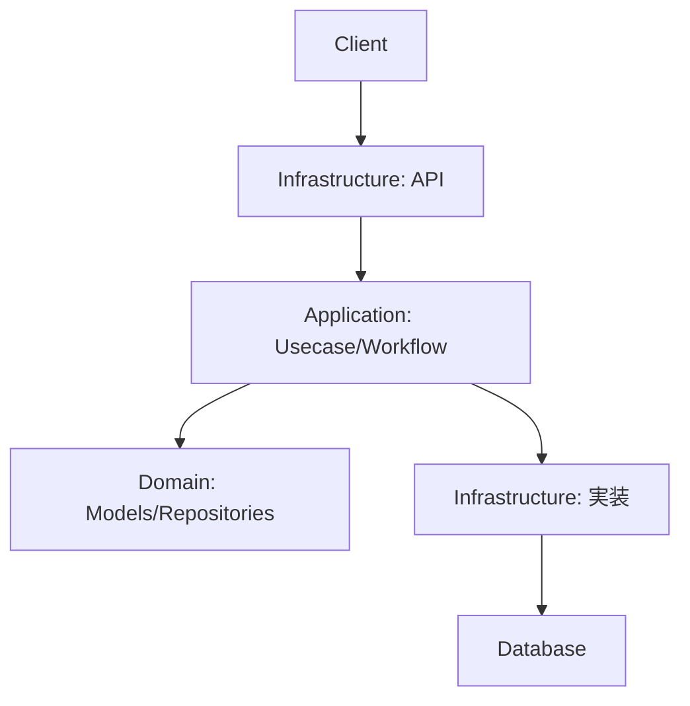
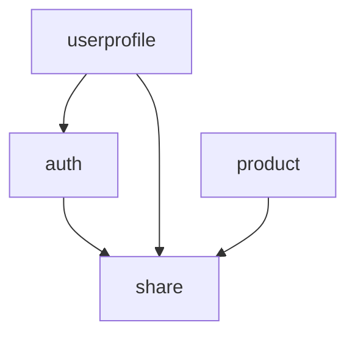

# アーキテクチャ概要

ECサイトバックエンドのアーキテクチャ構成。

## 設計原則

- **オニオンアーキテクチャ**: ドメイン中心設計
- **モジュラーモノリス**: Spring Modulithによる境界付けられたコンテキスト
- **イベント駆動**: ドメインイベントの活用

## 層構造

### 各層の責務

- **Domain層（中心）**: モデル、リポジトリインターフェース、ドメインイベント
- **Application層**: ユースケース、ワークフロー、ステップの定義
- **Infrastructure層**: ハンドラ、リポジトリ実装、外部サービス連携

## モジュール構成と依存関係

- **[auth](./05_MODULES/auth/README.md)**: 認証・アカウント管理
- **[userprofile](./05_MODULES/userprofile/README.md)**: ユーザー情報・住所管理
- **[product](./05_MODULES/product/README.md)**: 商品・カテゴリ・在庫・プロモーション管理
- **[share](./05_MODULES/share/README.md)**: 共通ユーティリティ（基盤モジュール）

## 技術スタック

- **リアクティブ**: Spring WebFlux + Project Reactor（`Mono`/`Flux`）による非同期処理
- **セキュリティ**: JWTベース認証、`PasswordEncoder`によるパスワードハッシュ化