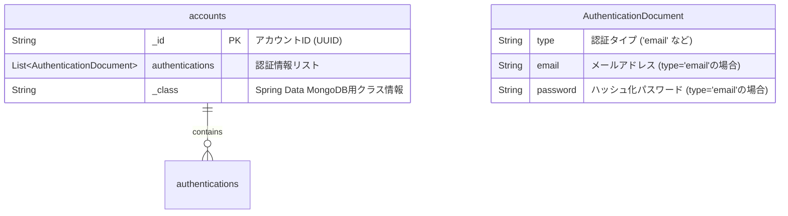
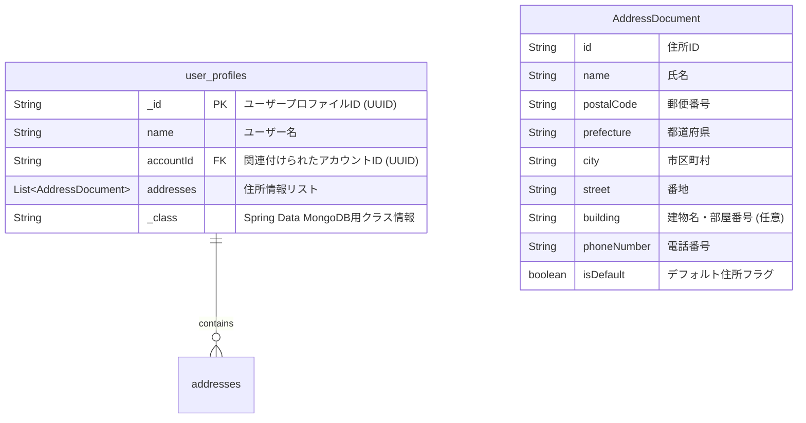

# 9. データベースガイド (MongoDB)

このドキュメントでは、`ecsite-v2` プロジェクトで使用しているデータベース (MongoDB) の概要、スキーマ設計、およびマイグレーションについて説明します。

## MongoDB 概要

本プロジェクトでは、データストアとしてドキュメント指向 NoSQL データベースである MongoDB を採用しています。柔軟なスキーマとリアクティブドライバーによる非同期アクセスが特徴です。

## コレクション一覧

現在、以下のコレクションを使用しています。

*   **`accounts`**: ユーザーアカウント情報を格納するコレクション。認証情報も埋め込みドキュメントとして保持します。
*   **`user_profiles`**: ユーザープロファイル情報を格納するコレクション。住所情報も埋め込みドキュメントとして保持します。

## スキーマ詳細 (`accounts` コレクション)

`accounts` コレクションのスキーマは、主に `AccountDocument` クラス (`auth` モジュール) によって定義されます。

**フィールド説明:**

*   **`_id` (String, PK):** ドキュメントの一意なID。`Account` ドメインモデルの `AccountId` に対応します。UUID 文字列が格納されます。
*   **`authentications` (List<AuthenticationDocument>):** このアカウントに関連付けられた認証情報のリスト。現在はメールアドレス認証 (`EmailAuthentication`) の情報が格納されます。
    *   **`type` (String):** 認証の種類を示す文字列。現在は `"email"` が想定されます。
    *   **`email` (String):** 認証に使用するメールアドレス。
    *   **`password` (String):** ハッシュ化されたパスワード。
*   **`_class` (String):** Spring Data MongoDB がポリモーフィックな型情報を格納するために自動的に追加するフィールド。通常は `com.example.ec_2024b_back.auth.infrastructure.repository.AccountDocument` が入ります。

**インデックス:**

*   `authentications.email`: メールアドレスによるアカウント検索を高速化するために、このフィールドにはインデックスを作成することが推奨されます。（`MongoAccounts` リポジトリの実装や、手動でのインデックス作成が必要です）

## データモデリング

*   **埋め込み (Embedding):** `Account` 集約内の `Authentication` 情報は、`accounts` ドキュメント内に `authentications` 配列として埋め込まれています。これにより、アカウント情報と認証情報を一度のクエリで取得できます。
*   **非正規化:** 現在のスキーマは比較的正規化されていますが、将来的にパフォーマンス向上のために特定の情報を非正規化して冗長に持たせる可能性があります。

## マイグレーション

*   現在、Flyway や Liquibase のようなデータベースマイグレーションツールは導入されていません。
*   スキーマ変更が必要な場合は、アプリケーションコードの変更と合わせて、手動でのデータ移行や更新スクリプトの実行が必要になる場合があります。
*   互換性を考慮し、アプリケーションのローリングアップデートなどに対応できるようなスキーマ変更戦略（例: フィールドの追加は許容するが、削除や変更は慎重に行う）を検討する必要があります。

## スキーマ詳細 (`user_profiles` コレクション)

`user_profiles` コレクションのスキーマは、主に `UserProfileDocument` クラス (`userprofile` モジュール) によって定義されます。

**フィールド説明:**

*   **`_id` (String, PK):** ドキュメントの一意なID。`UserProfile` ドメインモデルの `UserProfileId` に対応します。UUID文字列が格納されます。
*   **`name` (String):** ユーザーの氏名または表示名。
*   **`accountId` (String, FK):** このプロファイルに関連付けられたアカウントのID。`Account` ドメインモデルの `AccountId` を参照します。
*   **`addresses` (List<AddressDocument>):** このプロファイルに関連付けられた住所情報のリスト。
    *   **`id` (String):** 住所の一意なID。
    *   **`name` (String):** 配送先の氏名。
    *   **`postalCode` (String):** 郵便番号。
    *   **`prefecture` (String):** 都道府県。
    *   **`city` (String):** 市区町村。
    *   **`street` (String):** 番地。
    *   **`building` (String, オプション):** 建物名・部屋番号など（任意）。
    *   **`phoneNumber` (String):** 電話番号。
    *   **`isDefault` (boolean):** この住所がデフォルトとして設定されているかを示すフラグ。
*   **`_class` (String):** Spring Data MongoDB がポリモーフィックな型情報を格納するために自動的に追加するフィールド。

**インデックス:**

*   `accountId`: アカウントIDでのユーザープロファイル検索を高速化するために、このフィールドにはインデックスを作成することが推奨されます。
