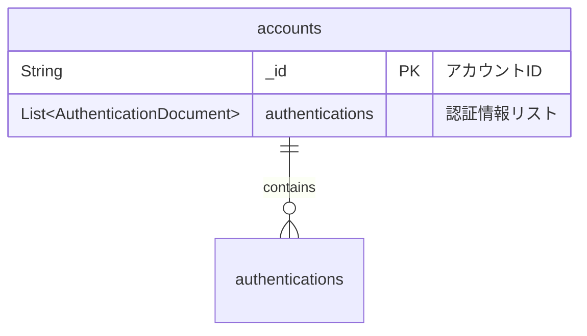
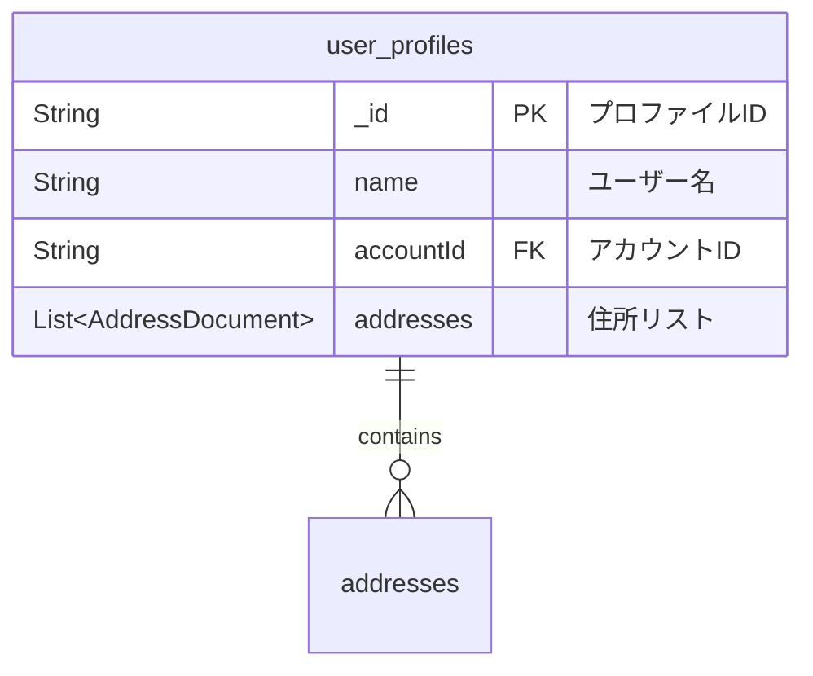
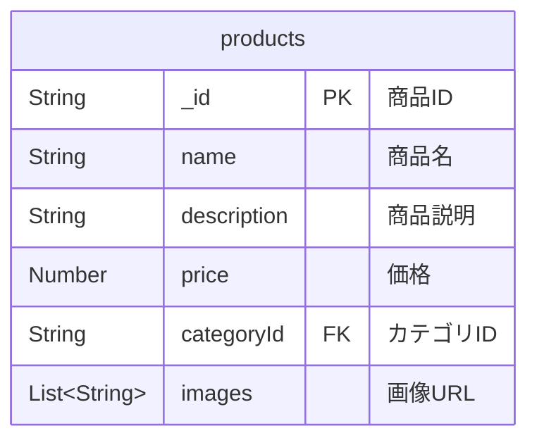
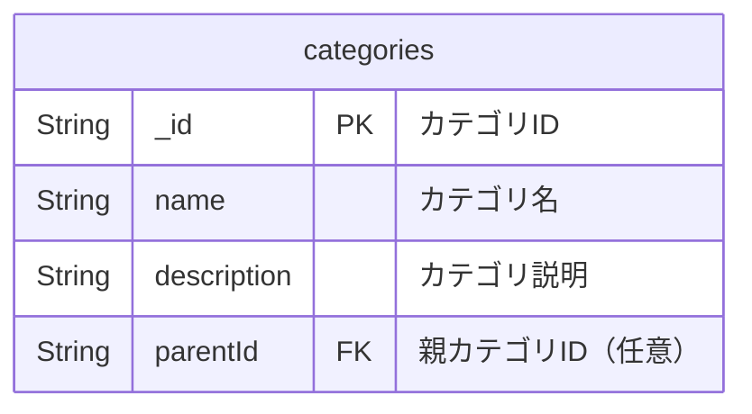
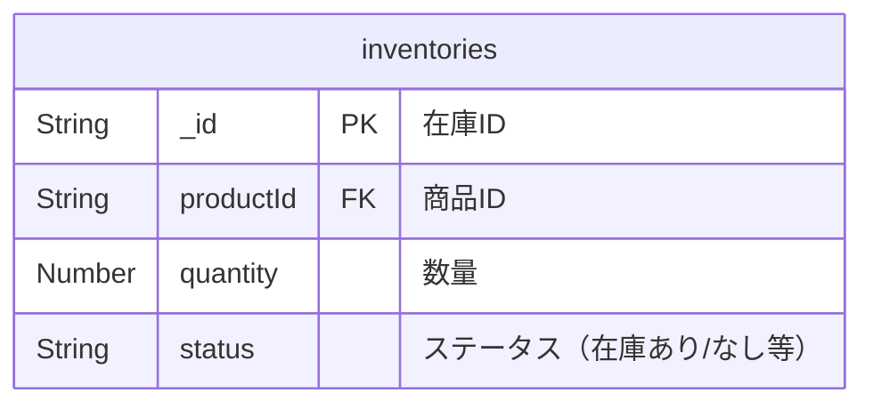
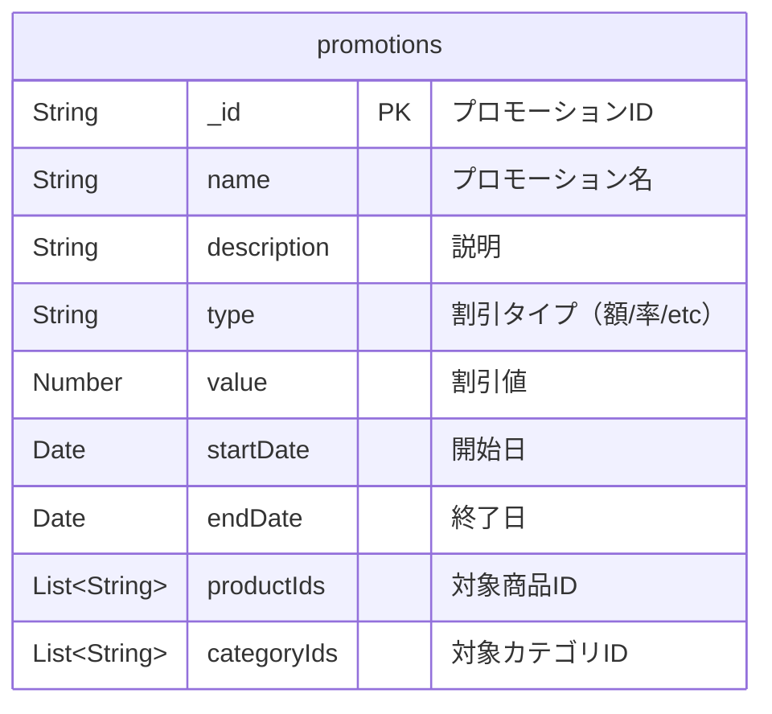

# データベース設計

MongoDB（ドキュメント指向NoSQL）を採用。リアクティブドライバーで非同期アクセスを実現。

## コレクション

- **`accounts`**: アカウント情報と認証情報
- **`user_profiles`**: ユーザープロファイルと住所情報
- **`products`**: 商品情報
- **`categories`**: カテゴリ情報
- **`inventories`**: 在庫情報
- **`promotions`**: プロモーション情報

## スキーマ詳細

### `accounts` コレクション

アカウントと認証情報を保存します。

**推奨インデックス:** `authentications.email`

### `user_profiles` コレクション

ユーザープロファイルと住所情報を保存します。

**推奨インデックス:** `accountId`

### `products` コレクション

商品情報を保存します。

**推奨インデックス:** `categoryId`, `name`

### `categories` コレクション

商品カテゴリ情報を保存します。

**推奨インデックス:** `parentId`, `name`

### `inventories` コレクション

在庫情報を保存します。

**推奨インデックス:** `productId`

### `promotions` コレクション

プロモーション情報を保存します。

**推奨インデックス:** `startDate`, `endDate`

## 設計ノート

- **埋め込みパターン:** 関連データを単一ドキュメント内に埋め込み
- **マイグレーション:** 専用ツール未導入。スキーマ変更は手動対応
