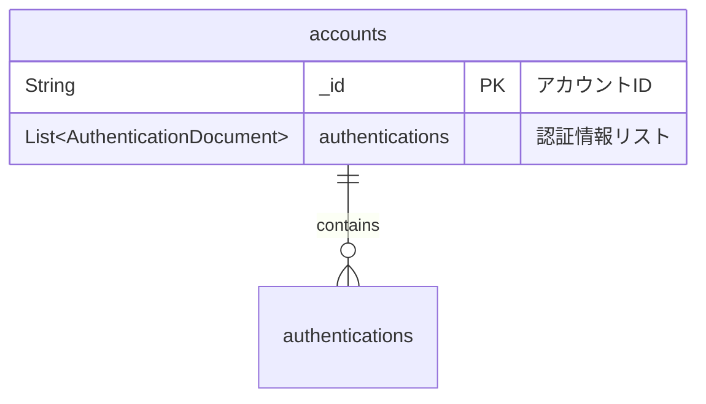
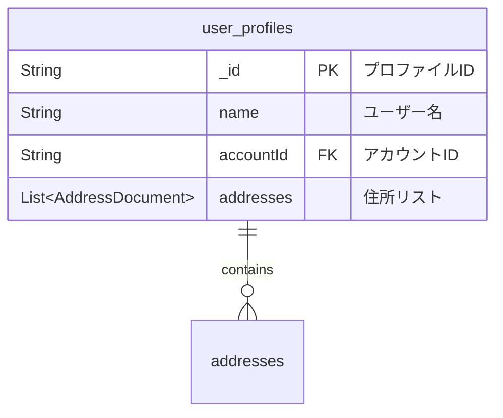

# データベース設計

MongoDB（ドキュメント指向NoSQL）を採用。リアクティブドライバーで非同期アクセスを実現。

## コレクション

- **`accounts`**: アカウント情報と認証情報
- **`user_profiles`**: ユーザープロファイルと住所情報

## スキーマ詳細

### `accounts` コレクション

アカウントと認証情報を保存します。

**推奨インデックス:** `authentications.email`

### `user_profiles` コレクション

ユーザープロファイルと住所情報を保存します。

**推奨インデックス:** `accountId`

## 設計ノート

- **埋め込みパターン:** 関連データを単一ドキュメント内に埋め込み
- **マイグレーション:** 専用ツール未導入。スキーマ変更は手動対応
