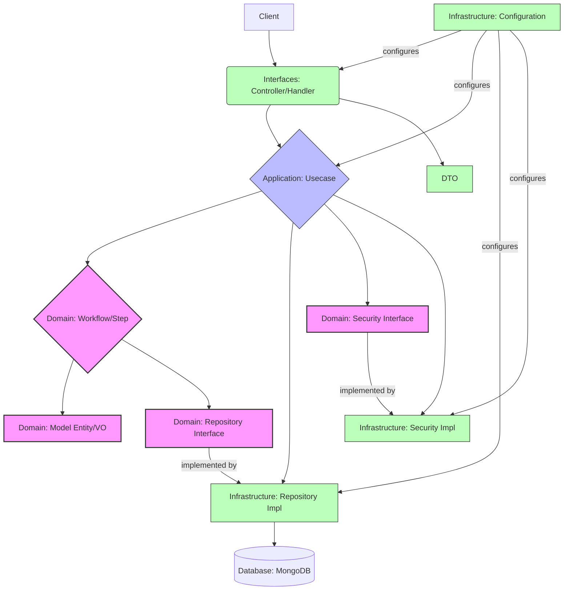
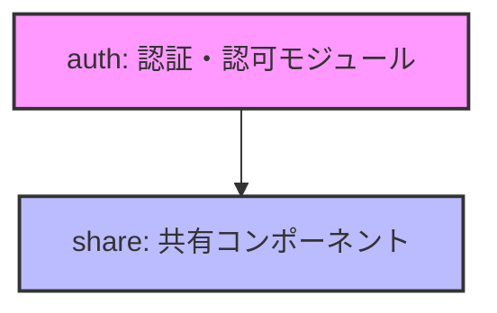
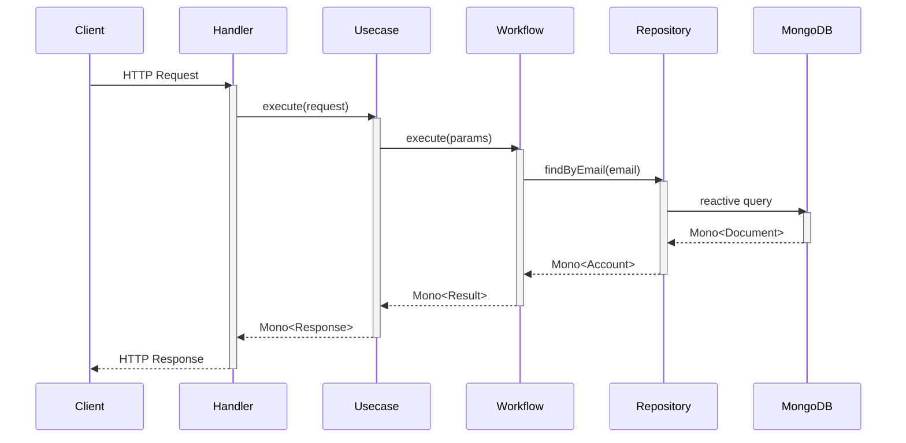
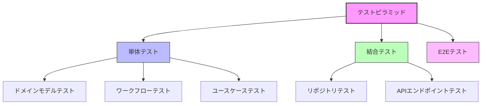

# ecsite-sample-spring

## 🚀 概要

**ecsite-sample-spring**は、最新のJava技術とアーキテクチャパターンを実践的に適用したリファレンス実装です。ECサイトのバックエンドとして設計されていますが、その真の価値は**モダンなソフトウェア設計原則と最先端技術の融合**にあります。

このプロジェクトは、以下の要素を中核に据えています：

- **オニオンアーキテクチャ**によるビジネスロジックの保護
- **Spring Modulith**を活用したモジュラーモノリス設計
- **リアクティブプログラミング**による非同期・ノンブロッキング処理
- **ドメイン駆動設計(DDD)**の原則に基づいた実装
- **最新のJava 23**の機能を活用したコーディング

## 🏗️ アーキテクチャ

本プロジェクトは、ドメインモデルを中心に据えたオニオンアーキテクチャを採用しています。

### リング構造

システムは3つの主要リングで構成されています：

#### 1. Domain リング (中心)
ビジネスロジックの中核を担います。
- **エンティティ/集約**: `Account`など
- **値オブジェクト**: `Email`, `JsonWebToken`, `AccountId`など
- **リポジトリインターフェース**: `Accounts`など
- **Workflow/Step**: `LoginWorkflow`, `FindAccountByEmailStep`など

#### 2. Application リング (中間)
アプリケーションのユースケースを実装します。
- **Usecaseクラス**: `LoginUsecase`, `SignupUsecase`など
- **トランザクション境界**
- **ドメインワークフロー/ステップの連携**

#### 3. Infrastructure リング (外側)
技術的な詳細を実装します。
- **REST API ハンドラー**: `LoginWithEmailHandler`など
- **リポジトリ実装**: `MongoAccounts`など
- **ドキュメントモデル**: `AccountDocument`など
- **セキュリティ実装**: `JsonWebTokenProvider`など

## 🧩 モジュール構成

- **auth**: ユーザー認証、アカウント管理
- **share**: 複数モジュールで共有されるコンポーネント

各モジュールは独自の責務を持ち、明確に定義された境界を持っています。モジュール間の依存関係は`package-info.java`ファイルで定義され、循環依存を避けるように設計されています。

## 💫 技術スタック

### フレームワーク・ライブラリ

- **Spring Boot 3.4.3**: アプリケーションフレームワーク
- **Spring Modulith 1.4.0-M3**: モジュラーモノリスアーキテクチャの実現
- **Spring WebFlux**: リアクティブWebスタック
- **Spring Data MongoDB Reactive**: MongoDBのリアクティブドライバ
- **Spring Security**: 認証・認可
- **Lombok 1.18.38**: ボイラープレートコードの削減
- **SpringDoc OpenAPI 2.3.0**: API ドキュメント生成
- **JSpecify 1.0.0**: null許容性アノテーション
- **Guava 33.4.8-jre**: Google Core Libraries for Java
- **jMolecules 1.10.0**: アーキテクチャ抽象化（オニオンアーキテクチャのサポート）
- **Auth0 Java JWT 4.4.0**: JWTライブラリ

### ビルド・ツール

- **Gradle**: ビルドツール
- **GraalVM Native Build Tools 0.10.6**: ネイティブイメージ生成
- **Spotless 7.0.3**: コード整形
- **Error Prone 2.37.0 / NullAway 0.12.6**: 静的解析ツール
- **Lefthook**: Gitフック管理

## 🌊 リアクティブプログラミングモデル

本システムはSpring WebFluxを採用し、以下の特徴を持つリアクティブプログラミングモデルを実装しています：

- **非ブロッキングI/O**: Nettyを利用し、スレッドリソースを効率的に活用
- **バックプレッシャー**: データ処理のフロー制御
- **宣言的プログラミング**: データフローの宣言的な表現
- **リアクティブストリーム**: Project Reactorの`Mono`と`Flux`を用いた非同期データストリーム

## 🧪 テスト戦略

- **単体テスト**: JUnit 5, Mockito, AssertJ, StepVerifier
- **結合テスト**: Testcontainers, WebTestClient
- **テスト実行速度分類**: `@Fast`, `@Slow`アノテーション

## 🛠️ 品質保証

- **静的解析**: Error Prone, NullAway
- **コード整形**: Spotless
- **Gitフック**: Lefthook
- **コードカバレッジ**: JaCoCo, Octocov

## 📚 学べること

このプロジェクトを通じて以下のスキルと知識を習得できます：

- **オニオンアーキテクチャ**の実践的な実装方法
- **ドメイン駆動設計**の原則とパターン
- **リアクティブプログラミング**の基本と応用
- **Spring Modulith**によるモジュラーモノリス設計
- **最新のJava機能**の活用方法
- **MongoDB**とのリアクティブな連携
- **JWT認証**の実装
- **効果的なテスト戦略**

## 🌟 特徴的な実装

- **ドメインモデルの独立性**: 技術的実装の詳細から保護されたドメインモデル
- **リポジトリの抽象化**: ドメイン層に定義されたインターフェース、インフラ層に実装
- **ワークフロー/ステップパターン**: ビジネスプロセスを明確に分離された責務に分割
- **Null安全性**: JSpecifyとNullAwayによる厳格なnull安全性チェック
- **リアクティブな一貫性**: リポジトリからコントローラーまで一貫したリアクティブ型の使用

## 📝 ライセンス

このプロジェクトはMITライセンスの下で公開されています。詳細はLICENSEファイルを参照してください。

---

このプロジェクトは、モダンなJavaバックエンド開発の集大成として、最新の技術とアーキテクチャパターンを実践的に適用しています。単なるECサイトの実装を超えて、持続可能で拡張性の高いエンタープライズアプリケーション開発のリファレンスとなることを目指しています。