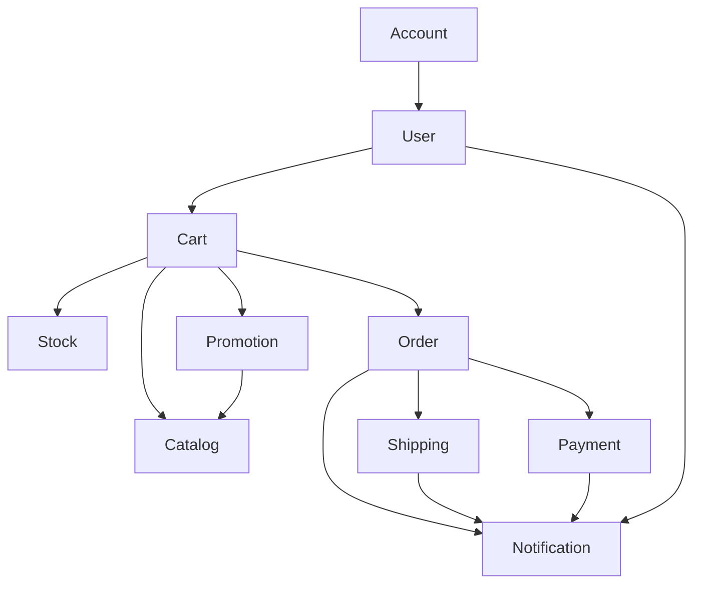

# アーキテクチャ設計

本プロジェクトは、モダンな設計手法とパターンを取り入れたECサイトのバックエンドシステムです。このドキュメントでは、採用されているアーキテクチャの主要な特徴と設計思想について説明します。

## 基本方針

システムは以下の要素を基盤とした構成を採用しています：

- **クリーンアーキテクチャ/ヘキサゴナルアーキテクチャ**: ビジネスロジックと技術的詳細の分離
- **モジュラーモノリス**: Spring Modulithを利用した境界づけられたコンテクスト
- **リアクティブプログラミング**: Spring WebFluxによる非同期処理
- **イベント駆動型アーキテクチャ**: システムの状態変更をイベントとして表現

## アーキテクチャの全体像

```mermaid
graph TD
    A[Client] --> B(Interfaces: Controller);
    B --> C{Application: Usecase};
    C --> E{Domain: Workflow/Step};
    E --> F[Domain: Model];
    C --> G[Infrastructure: Repository];
    G --> H[(Database)];
    C --> I[Infrastructure: Security];
    J[Infrastructure: Configuration] -- configures --> B;
    J -- configures --> C;
    J -- configures --> G;
    J -- configures --> I;
    B --> K[DTO (Generated)];
```
*(図は簡略化されています)*

## レイヤー構造

システムは以下の4つの主要レイヤーで構成されています：

### 1. Interfaces (Adapter) レイヤー

外部システムとのインターフェースを担当します。

- **REST APIコントローラー**: クライアントからのHTTPリクエストを受け取り、レスポンスを返す
- **DTOオブジェクト**: APIとの通信に使用されるデータ構造（OpenAPIから自動生成）
- **バリデーション**: 入力データの検証

### 2. Application レイヤー

アプリケーションのユースケースを実装します。

- **Usecaseクラス**: 各機能のビジネスロジックを調整・実行
- **トランザクション境界**: データの一貫性を保証
- **ドメインサービスの連携**: 複雑なビジネスロジックの実行

### 3. Domain レイヤー

ビジネスロジックの中核を担います。

- **エンティティ**: ビジネスオブジェクトとそのライフサイクル
- **値オブジェクト**: 変更不可能なビジネス値
- **集約**: 一貫性境界を持つエンティティと値オブジェクトのクラスター
- **ドメインイベント**: ドメインの状態変更を表すイベント
- **Workflow/Step**: ビジネスプロセスのフロー制御

### 4. Infrastructure レイヤー

技術的な詳細を実装します。

- **リポジトリ実装**: データアクセスロジック
- **セキュリティ実装**: 認証・認可のメカニズム
- **外部サービス連携**: 決済サービスなどの外部APIとの連携
- **設定**: アプリケーション全体の設定

## モジュール構成

システムは機能的な関心事に基づいて以下のモジュールに分割されています：

1. **Account**: アカウント管理、認証・認可
2. **User**: ユーザープロファイル管理
3. **Cart**: ショッピングカート機能
4. **Catalog**: 商品カタログ管理
5. **Stock**: 在庫管理
6. **Order**: 注文処理
7. **Payment**: 決済処理
8. **Promotion**: キャンペーン・割引管理
9. **Shipping**: 配送管理
10. **Notification**: 通知管理

各モジュールは独自の責務を持ち、明確に定義された境界を持っています。モジュール間の依存関係は`package-info.java`ファイルで定義され、循環依存を避けるように設計されています。

## 依存・参照関係

モジュール間の主要な依存関係は以下の通りです：



## リアクティブプログラミングモデル

本システムはSpring WebFluxを採用し、以下の特徴を持つリアクティブプログラミングモデルを実装しています：

- **非ブロッキングI/O**: スレッドリソースの効率的な利用
- **バックプレッシャー**: データ処理のフロー制御
- **宣言的プログラミング**: データフローの宣言的な表現
- **リアクティブストリーム**: `Mono`と`Flux`を用いた非同期データストリーム

## セキュリティモデル

システムのセキュリティは以下の要素で構成されています：

- **認証**: JWT (JSON Web Token) ベースの認証
- **認可**: ロールベースのアクセス制御（RBAC）
- **セキュアなパスワードハンドリング**: BCryptによるハッシュ化
- **CSRFトークン**: クロスサイトリクエストフォージェリ対策

## まとめ

本アーキテクチャは、ビジネスロジックの独立性を確保しつつ、高いスケーラビリティと保守性を実現するために設計されています。ドメイン駆動設計の考え方を取り入れ、ビジネスの複雑さを効果的にモデル化しながら、技術的な実装の詳細との結合を最小限に抑えています。
