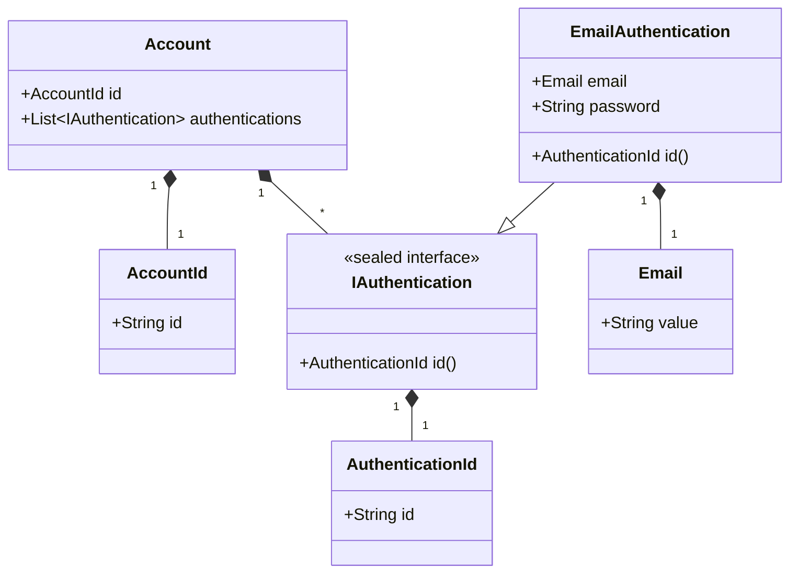

# Account モジュール

このドキュメントでは、`account` モジュールの責務、ドメインモデル、主要な機能について説明します。

*(現在執筆中です)*

## 責務

*(アカウント作成、認証、情報更新など、このモジュールが担当するビジネス機能を記載予定)*

## ドメインモデル

`account` モジュールの主要なドメインモデルは以下の通りです。

*   **`Account` (Record):**
    *   責務: ユーザーアカウント全体を表す集約ルート。
    *   主要プロパティ:
        *   `id`: アカウントID (`AccountId` 値オブジェクト)。
        *   `authentications`: このアカウントに関連付けられた認証方法のリスト (`List<IAuthentication>`)。
*   **`AccountId` (Record, Value Object):**
    *   責務: アカウントの一意な識別子。
    *   プロパティ: `id` (String)。空でないことが保証されます。
*   **`IAuthentication` (Sealed Interface):**
    *   責務: 認証方法の共通インターフェース。現在は `EmailAuthentication` のみが許可されています (将来的に他の認証方法、例: OAuth を追加可能)。
    *   メソッド: `id()` (認証方法の種類を示す `AuthenticationId` を返す)。
*   **`AuthenticationId` (Record, Value Object):**
    *   責務: 認証方法の種類を示す識別子 (例: "email")。
    *   プロパティ: `id` (String)。null または空でないことが保証されます。
*   **`EmailAuthentication` (Record):**
    *   責務: メールアドレスとパスワードによる認証方法を表します。`IAuthentication` を実装します。
    *   主要プロパティ:
        *   `email`: メールアドレス (`com.example.ec_2024b_back.share.domain.models.Email` 値オブジェクト)。
        *   `password`: ハッシュ化されたパスワード (String)。
    *   `id()` は `"email"` を固定で返します。

**クラス図 (簡易):**

*(注: `Email` は `share` モジュールの値オブジェクトです)*

## 主要フロー

*(アカウント登録フロー、ログインフローなどのシーケンス図などを記載予定)*

## 主要クラス解説

*(Service, Repository, Delegate などの役割を記載予定)*

## 関連API

*(このモジュールが公開するAPIエンドポイント一覧を記載予定)*

## DBコレクション

*(使用するMongoDBコレクションとフィールドを記載予定)*

## 他モジュールとの連携

*(依存している/されているモジュール、連携方法などを記載予定)*
