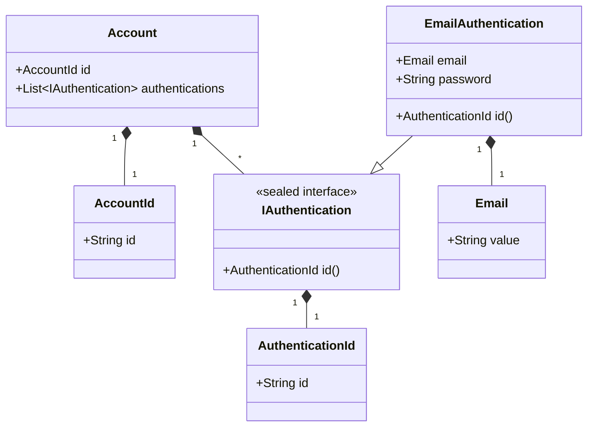

# Account モジュール

このドキュメントでは、`account` モジュールの責務、ドメインモデル、主要な機能について説明します。

## 責務

`account` モジュールは、ユーザーアカウントに関連する以下の主要な責務を担当します。

*   **認証:**
    *   ユーザーの本人確認を行います。現在はメールアドレスとパスワードによる認証をサポートしています。
    *   認証成功時には、後続のリクエストで使用するための認証情報（例: JWT）を発行します。
*   **アカウント管理:** (将来実装予定)
    *   アカウントの新規作成
    *   アカウント情報の参照・更新
    *   パスワード変更・リセット
    *   退会処理

## ドメインモデル

`account` モジュールの主要なドメインモデルは以下の通りです。

*   **`Account` (Record):**
    *   責務: ユーザーアカウント全体を表す集約ルート。
    *   主要プロパティ:
        *   `id`: アカウントID (`AccountId` 値オブジェクト)。
        *   `authentications`: このアカウントに関連付けられた認証方法のリスト (`List<IAuthentication>`)。
*   **`AccountId` (Record, Value Object):**
    *   責務: アカウントの一意な識別子。
    *   プロパティ: `id` (String)。空でないことが保証されます。
*   **`IAuthentication` (Sealed Interface):**
    *   責務: 認証方法の共通インターフェース。現在は `EmailAuthentication` のみが許可されています (将来的に他の認証方法、例: OAuth を追加可能)。
    *   メソッド: `id()` (認証方法の種類を示す `AuthenticationId` を返す)。
*   **`AuthenticationId` (Record, Value Object):**
    *   責務: 認証方法の種類を示す識別子 (例: "email")。
    *   プロパティ: `id` (String)。null または空でないことが保証されます。
*   **`EmailAuthentication` (Record):**
    *   責務: メールアドレスとパスワードによる認証方法を表します。`IAuthentication` を実装します。
    *   主要プロパティ:
        *   `email`: メールアドレス (`com.example.ec_2024b_back.share.domain.models.Email` 値オブジェクト)。
        *   `password`: ハッシュ化されたパスワード (String)。
    *   `id()` は `"email"` を固定で返します。

**クラス図 (簡易):**


*(注: `Email` は `share` モジュールの値オブジェクトです)*

## 主要フロー

### ログインフロー

ユーザーがメールアドレスとパスワードでログインする際の主要なフローは以下の通りです。

1.  **リクエスト受信:** ユーザーからログインリクエスト (メールアドレス, パスワード) を受け取ります (`AuthenticationController`)。
2.  **ユースケース実行:** `LoginUsecase` を呼び出します。
3.  **ワークフロー実行:** `LoginWorkflow` を実行します。
    1.  **ユーザー検索:** メールアドレスを基に `user` モジュールにユーザー情報を問い合わせます (`FindUserByEmailStep`)。ユーザーが見つからない場合はエラー。
    2.  **パスワード検証:** 提供されたパスワードと保存されているハッシュ化パスワードを比較検証します (`VerifyPasswordStep`)。一致しない場合はエラー。
    3.  **JWT生成:** 認証成功後、ユーザー情報に基づいて JWT (JSON Web Token) を生成します (`GenerateJwtTokenStep`)。
4.  **レスポンス返却:** 生成された JWT をユーザーに返却します。

```mermaid
sequenceDiagram
    participant User
    participant Controller as AuthenticationController
    participant Usecase as LoginUsecase
    participant Workflow as LoginWorkflow
    participant FindStep as FindUserByEmailStep
    participant VerifyStep as VerifyPasswordStep
    participant GenerateStep as GenerateJwtTokenStep
    participant UserRepo as UserRepository (user module)
    participant TokenProvider as JsonWebTokenProvider (share module)

    User->>+Controller: POST /login (email, password)
    Controller->>+Usecase: login(email, password)
    Usecase->>+Workflow: execute(email, password)
    Workflow->>+FindStep: findUser(email)
    FindStep->>+UserRepo: findByEmail(email)
    UserRepo-->>-FindStep: User
    FindStep-->>-Workflow: User
    Workflow->>+VerifyStep: verify(password, user.passwordHash)
    VerifyStep-->>-Workflow: (Verification Result)
    alt パスワード不一致
        Workflow-->>-Usecase: AuthenticationException
        Usecase-->>-Controller: AuthenticationException
        Controller-->>-User: 401 Unauthorized
    end
    Workflow->>+GenerateStep: generateToken(user)
    GenerateStep->>+TokenProvider: generate(user)
    TokenProvider-->>-GenerateStep: JWT
    GenerateStep-->>-Workflow: JWT
    Workflow-->>-Usecase: JWT
    Usecase-->>-Controller: JWT
    Controller-->>-User: 200 OK (JWT)

```

*(アカウント登録フローなどは将来追加予定)*

## 主要クラス解説

`account` モジュール内の主要なクラスとその役割は以下の通りです。

*   **`LoginUsecase`:**
    *   役割: ログイン機能のアプリケーションサービス層。外部（Controller）からのリクエストを受け付け、ドメインロジック（Workflow）を呼び出し、結果を返却します。
*   **`LoginWorkflow`:**
    *   役割: ログイン処理のドメインワークフロー。複数のドメインステップ（ユーザー検索、パスワード検証、JWT生成）を順に実行し、ログインプロセス全体を調整します。
*   **`FindUserByEmailStep` (Interface) / `FindUserByEmailStepImpl` (Implementation):**
    *   役割: メールアドレスに基づいてユーザー情報を取得するドメインステップ。実装クラス (`Impl`) は `user` モジュールの `UserRepository` を利用します。
*   **`VerifyPasswordStep` (Interface) / `VerifyPasswordStepImpl` (Implementation):**
    *   役割: 提供されたパスワードとハッシュ化されたパスワードを比較検証するドメインステップ。実装クラス (`Impl`) は Spring Security の `PasswordEncoder` を利用します。
*   **`GenerateJwtTokenStep` (Interface) / `GenerateJwtTokenStepImpl` (Implementation):**
    *   役割: 認証されたユーザー情報に基づいて JWT を生成するドメインステップ。実装クラス (`Impl`) は `share` モジュールの `JsonWebTokenProvider` を利用します。
*   **`SecurityConfig`:**
    *   役割: Spring Security の設定クラス。パスワードエンコーダーの Bean 定義や、認証を必要としないパス（例: `/login`）の設定などを行います。
*   **`AuthenticationController` (interfaces.rest package):**
    *   役割: ログイン API (`/login`) のエンドポイントを提供する REST Controller。`LoginUsecase` を呼び出します。

*(他の Service, Repository, Delegate などは将来追加予定)*

## 関連API

*(このモジュールが公開するAPIエンドポイント一覧を記載予定)*

## DBコレクション

*(使用するMongoDBコレクションとフィールドを記載予定)*

## 他モジュールとの連携

*(依存している/されているモジュール、連携方法などを記載予定)*
