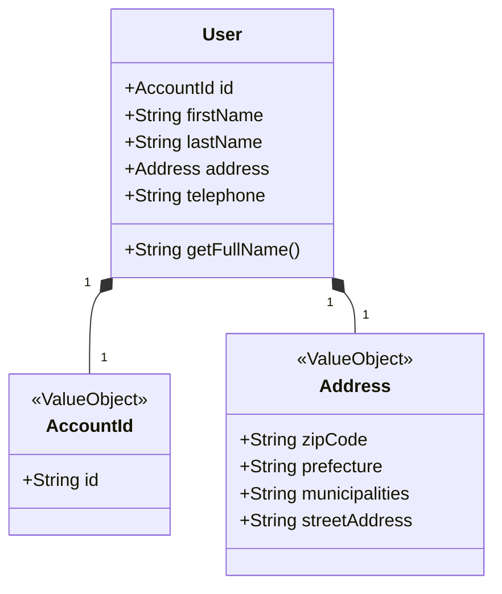

# User モジュール

このドキュメントでは、`user` モジュールの責務、ドメインモデル、主要な機能について説明します。

*(現在執筆中です)*

## 責務

*(ユーザー情報の管理、プロフィール機能など、このモジュールが担当するビジネス機能を記載予定)*

## ドメインモデル

`user` モジュールの主要なドメインモデルは以下の通りです。

*   **`User` (Record):**
    *   責務: ユーザーの基本情報（プロフィール情報）を表します。アカウント集約 (`account` モジュール) とは分離されています。
    *   主要プロパティ:
        *   `id`: アカウントID (`com.example.ec_2024b_back.auth.domain.models.Account.AccountId` 値オブジェクト)。`account` モジュールと共通のIDを使用します。
        *   `firstName`: 名 (String)。
        *   `lastName`: 姓 (String)。
        *   `address`: 住所 (`com.example.ec_2024b_back.share.domain.models.Address` 値オブジェクト)。
        *   `telephone`: 電話番号 (String)。
    *   コンストラクタで各フィールドの基本的なバリデーション (空でないこと) を行います。
    *   `getFullName()` メソッドで姓名を連結した文字列を取得できます。

**クラス図 (簡易):**

*(注: `AccountId` は `account` モジュール、`Address` は `share` モジュールの値オブジェクトです)*

## 主要フロー

*(ユーザー情報取得フロー、プロフィール更新フローなどのシーケンス図などを記載予定)*

## 主要クラス解説

*   **`UserRepository` (Interface):**
    *   場所: `com.example.ec_2024b_back.user.domain.repository`
    *   責務: `User` ドメインオブジェクトの永続化に関するインターフェースを定義します。ドメイン層に配置され、インフラストラクチャ層の詳細（例: MongoDB）から独立しています。
    *   主要メソッド:
        *   `findByEmail(String email)`: メールアドレスを基にユーザーを検索します。
*   **`MongoUserRepository` (Class):**
    *   場所: `com.example.ec_2024b_back.user.infrastructure.repository`
    *   責務: `UserRepository` インターフェースの MongoDB 実装を提供します。Spring Data MongoDB を利用してデータベース操作を行います。

*(その他の Service, Delegate などの役割を記載予定)*

## 関連API

*(このモジュールが公開するAPIエンドポイント一覧を記載予定)*

## DBコレクション

*(使用するMongoDBコレクションとフィールドを記載予定)*

## 他モジュールとの連携

*(依存している/されているモジュール、連携方法などを記載予定)*
