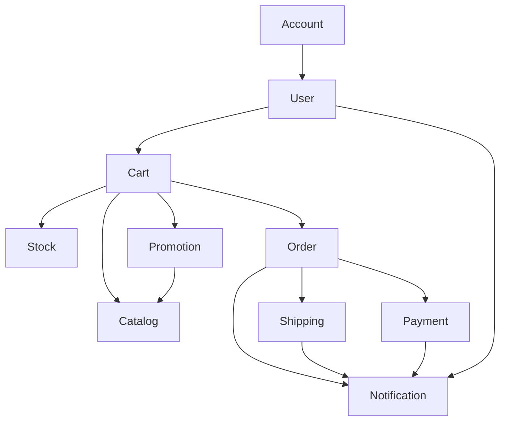

## ドメイン一覧

1. Account
2. User
3. Cart
4. Catalog
5. Stock
6. Order
7. Payment
8. Promotion
9. Shipping
10. Notification

---

## 境界づけられたコンテキスト（Bounded Context）

| コンテキスト名 | まとめるドメイン |
| ------- | -------- |
|         |          |

|   |
| - |

| **Authentication Context**     | Account                   |
| ------------------------------ | ------------------------- |
| **User Profile Context**       | User                      |
| **Product Management Context** | Catalog, Stock, Promotion |
| **Shopping Context**           | Cart, Order, Payment      |
| **Logistics Context**          | Shipping                  |
| **Notification Context**       | Notification              |

---

## 依存・参照関係案（初期バージョン）

### 関係メモ

- **Account → User**: 認証 (Account) とプロファイル (User) を分離。認証が先行し、User登録が続くことがある。
- **User → Cart**: ログインユーザーに紐づくカートを保持する。
- **Cart → Catalog / Stock / Promotion**: 商品情報 (Catalog)、在庫状況 (Stock)、割引条件 (Promotion) をカート表示・更新時に参照する。
- **Cart → Order**: カートの内容が確定すると、注文 (Order) へ昇格する。
- **Order → Payment / Shipping / Notification**: 注文完了後、支払い要求 (Payment)、配送手配 (Shipping)、通知 (Notification) を行う。
- **Shipping → Notification**: 配送ステータス更新時に通知を発行する。
- **Payment → Notification**: 支払い完了や失敗時に通知を発行する。
- **Promotion → Catalog**: カタログ上にキャンペーン価格等を反映させるため、PromotionがCatalogに影響を与える。
- **User → Notification**: ユーザー設定に基づいて通知を送る。（例：注文完了メール、発送完了メールなど）

---

## ドメイン別コマンド & イベント（概要リスト）

> **※ 名前だけ。詳細なペイロード設計はこのあとで!**

### Authentication Context – Account

- **Commands**: `RegisterAccount`, `ChangePassword`, `AssignRole`
- **Events**: `AccountRegistered`, `PasswordChanged`, `RoleAssigned`

### User Profile Context – User

- **Commands**: `CreateUserProfile`, `UpdateUserProfile`, `AddAddress`, `RemoveAddress`
- **Events**: `UserProfileCreated`, `UserProfileUpdated`, `AddressAdded`, `AddressRemoved`

### Product Management Context

- **Catalog**
  - **Commands**: `CreateProduct`, `UpdateProductInfo`, `RetireProduct`
  - **Events**: `ProductCreated`, `ProductInfoUpdated`, `ProductRetired`
- **Stock**
  - **Commands**: `AdjustInventory`, `ReserveStock`, `ReleaseStock`
  - **Events**: `InventoryAdjusted`, `StockReserved`, `StockReleased`, `StockDepleted`
- **Promotion**
  - **Commands**: `CreatePromotion`, `ActivatePromotion`, `DeactivatePromotion`
  - **Events**: `PromotionCreated`, `PromotionActivated`, `PromotionDeactivated`

### Shopping Context

- **Cart**
  - **Commands**: `AddItemToCart`, `RemoveItemFromCart`, `ChangeItemQuantity`, `ClearCart`
  - **Events**: `ItemAddedToCart`, `ItemRemovedFromCart`, `ItemQuantityChanged`, `CartCleared`
- **Order**
  - **Commands**: `PlaceOrder`, `CancelOrder`, `MarkOrderPaid`, `MarkOrderShipped`, `CloseOrder`
  - **Events**: `OrderPlaced`, `OrderCancelled`, `OrderPaid`, `OrderShipped`, `OrderClosed`
- **Payment**
  - **Commands**: `AuthorizePayment`, `CapturePayment`, `RefundPayment`
  - **Events**: `PaymentAuthorized`, `PaymentCaptured`, `PaymentFailed`, `PaymentRefunded`

### Logistics Context – Shipping

- **Commands**: `CreateShipment`, `UpdateShipmentStatus`
- **Events**: `ShipmentCreated`, `ShipmentStatusUpdated`, `ShipmentDelivered`

### Notification Context – Notification

- **Commands**: `SendNotification`
- **Events**: `NotificationSent`, `NotificationFailed`
