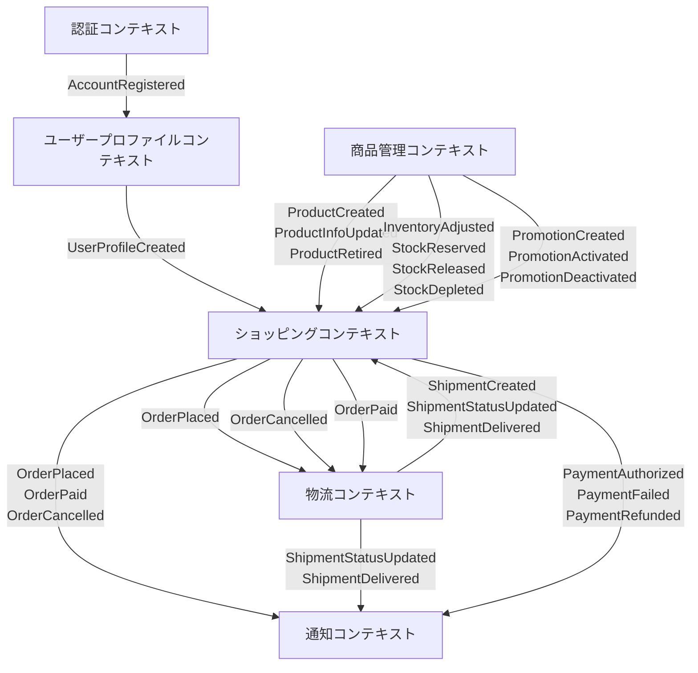
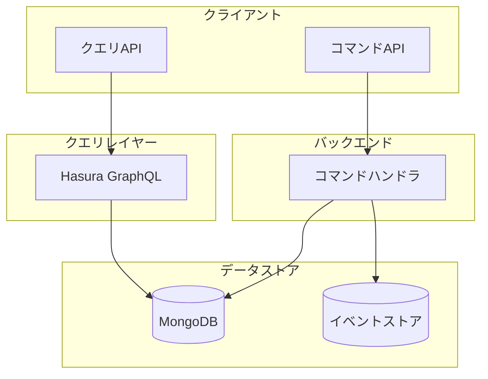
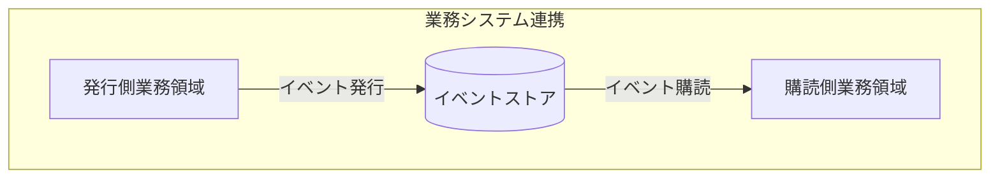

# ドメイン設計概要

## ドメイン一覧

1. Account
2. User
3. Cart
4. Catalog
5. Stock
6. Order
7. Payment
8. Promotion
9. Shipping
10. Notification

---

## 境界づけられたコンテキスト（Bounded Context）

| コンテキスト名 | まとめるドメイン |
| ------- | -------- |
| **認証コンテキスト** (Authentication Context)     | Account                   |
| **ユーザープロファイルコンテキスト** (User Profile Context)       | User                      |
| **商品管理コンテキスト** (Product Management Context) | Catalog, Stock, Promotion |
| **ショッピングコンテキスト** (Shopping Context)           | Cart, Order, Payment      |
| **物流コンテキスト** (Logistics Context)          | Shipping                  |
| **通知コンテキスト** (Notification Context)       | Notification              |

---

## 依存・参照関係

### 関係メモ

- **認証 → ユーザープロファイル**: 認証とプロファイルを分離。認証が先行し、プロファイル登録が続く。
- **ユーザープロファイル → ショッピング**: プロファイル作成時にカートが初期化される。
- **商品管理 → ショッピング**: 商品情報、在庫状況、割引条件をショッピングコンテキストに提供。
- **ショッピング → 物流**: 注文確定後、配送手配が行われる。
- **ショッピング/物流 → 通知**: 重要なイベント発生時に通知を行う。

---

## CQRS設計

本システムではコマンドクエリ責務分離(CQRS)パターンを採用しています。

### 全体アーキテクチャ

### 特徴

1. **コマンド側**: 状態を変更する全ての操作は明示的なコマンドとして定義され、専用のハンドラで処理されます。
2. **クエリ側**: データ参照のみを行う操作はHasuraを通じてGraphQLで提供され、MongoDBに直接アクセスします。
3. **イベント連携**: コンテキスト間の通信はイベントを通じて行われ、疎結合を実現します。

---

## イベント連携メカニズム

各業務領域（バウンデッドコンテキスト）間はイベント駆動で連携します。

### イベント連携の特徴

1. **緩やかな結合**: 各業務領域は互いに直接依存せず、イベントを介して間接的に連携します。これにより、変更の影響範囲を最小限に抑えることができます。

2. **業務の自律性**: 各業務領域は自分の責任範囲内で完結する処理を行い、必要に応じてイベントを発行または購読します。

3. **ビジネスの変化に強い**: 新しい業務要件が発生した場合、既存の領域に影響を与えることなく、新しいイベント購読者を追加できます。

### イベントの一貫性

業務領域間のイベント連携における一貫性モデルは、「結果整合性（Eventual Consistency）」に基づいています。これは以下のような特徴があります：

1. **非同期処理**: イベントは非同期で処理されるため、イベント発行側はイベント発行後、即座に次の処理に進むことができます。

2. **最終的な一貫性**: システム全体では一時的に不整合が生じる可能性がありますが、最終的には整合性が取れることを保証します。

3. **業務の現実に即した設計**: 現実の業務でも情報の伝達には時間差があり、システムもそれに合わせた設計となっています。

---

## 各バウンデッドコンテキストのコマンドとイベント

### 認証コンテキスト (Authentication Context)

#### ユーザー向けコマンド

| コマンド名 | 説明 | 主なパラメータ |
|------------|------|------------|
| `SignupWithEmail` | メールとパスワードでの新規ユーザー登録 | `email`, `password` |
| `LoginWithEmail` | メールとパスワードでのログイン | `email`, `password` |
| `ChangePassword` | パスワード変更 | `accountId`, `currentPassword`, `newPassword` |
| `RequestPasswordReset` | パスワードリセット要求 | `email` |
| `ExecutePasswordReset` | パスワードリセット実行 | `resetToken`, `newPassword` |

#### イベント

| イベント名 | 説明 | 主な情報 | 購読コンテキスト |
|------------|------|---------|--------------|
| `AccountRegistered` | アカウント登録完了 | `accountId`, `email` | ユーザープロファイルコンテキスト |
| `PasswordChanged` | パスワード変更完了 | `accountId` | - |
| `PasswordResetRequested` | パスワードリセット要求 | `accountId`, `resetToken` | 通知コンテキスト |
| `PasswordResetExecuted` | パスワードリセット完了 | `accountId` | 通知コンテキスト |

### ユーザープロファイルコンテキスト (User Profile Context)

#### ユーザー向けコマンド

| コマンド名 | 説明 | 主なパラメータ |
|------------|------|------------|
| `CreateUserProfile` | ユーザープロファイル作成 | `accountId`, `name` |
| `UpdateUserProfile` | ユーザープロファイル更新 | `userProfileId`, `name` |
| `AddAddress` | 住所追加 | `userProfileId`, `address` |
| `RemoveAddress` | 住所削除 | `userProfileId`, `addressId` |
| `SetDefaultAddress` | デフォルト住所設定 | `userProfileId`, `addressId` |

#### イベント

| イベント名 | 説明 | 主な情報 | 購読コンテキスト |
|------------|------|---------|--------------|
| `UserProfileCreated` | プロファイル作成完了 | `accountId`, `userProfileId`, `name` | ショッピングコンテキスト |
| `UserProfileUpdated` | プロファイル更新完了 | `userProfileId`, `name` | - |
| `AddressAdded` | 住所追加完了 | `userProfileId`, `addressId`, `address` | - |
| `AddressRemoved` | 住所削除完了 | `userProfileId`, `addressId` | - |
| `DefaultAddressSet` | デフォルト住所設定完了 | `userProfileId`, `addressId` | - |

### 商品管理コンテキスト (Product Management Context)

#### イベント

| イベント名 | 説明 | 主な情報 | 購読コンテキスト |
|------------|------|---------|--------------|
| `ProductCreated` | 商品作成完了 | `productId`, `name`, `price`, `categoryId` | ショッピングコンテキスト |
| `ProductInfoUpdated` | 商品情報更新完了 | `productId`, `name`, `price`, `description` | ショッピングコンテキスト |
| `ProductRetired` | 商品取扱終了完了 | `productId` | ショッピングコンテキスト |
| `CategoryCreated` | カテゴリ作成完了 | `categoryId`, `name`, `parentCategoryId` | - |
| `CategoryUpdated` | カテゴリ更新完了 | `categoryId`, `name`, `description` | - |
| `InventoryAdjusted` | 在庫調整完了 | `inventoryId`, `productId`, `oldQuantity`, `newQuantity` | ショッピングコンテキスト |
| `StockDepleted` | 在庫切れ発生 | `inventoryId`, `productId` | ショッピングコンテキスト, 通知コンテキスト |
| `PromotionCreated` | プロモーション作成完了 | `promotionId`, `name`, `discountType`, `discountValue` | ショッピングコンテキスト |
| `PromotionActivated` | プロモーション有効化完了 | `promotionId` | ショッピングコンテキスト |
| `PromotionDeactivated` | プロモーション無効化完了 | `promotionId` | ショッピングコンテキスト |

### ショッピングコンテキスト (Shopping Context)

#### ユーザー向けコマンド

| コマンド名 | 説明 | 主なパラメータ |
|------------|------|------------|
| `GetOrCreateCart` | カート取得/作成 | `accountId` |
| `AddItemToCart` | カートに商品追加 | `cartId`, `productId`, `quantity` |
| `RemoveItemFromCart` | カートから商品削除 | `cartId`, `productId` |
| `UpdateItemQuantity` | カート内商品数量更新 | `cartId`, `productId`, `quantity` |
| `ClearCart` | カート内容クリア | `cartId` |
| `CreateOrderFromCart` | カートから注文作成 | `cartId`, `shippingAddressId`, `paymentMethod` |
| `CancelOrder` | 注文キャンセル | `orderId`, `reason` |
| `InitiatePayment` | 支払い開始 | `orderId`, `paymentMethod` |
| `AuthorizePayment` | 支払い承認 | `paymentId`, `authorizationCode` |

#### イベント

| イベント名 | 説明 | 主な情報 | 購読コンテキスト |
|------------|------|---------|--------------|
| `CartCreated` | カート作成完了 | `cartId`, `accountId` | - |
| `ItemAddedToCart` | カートへ商品追加完了 | `cartId`, `productId`, `productName`, `quantity` | - |
| `ItemRemovedFromCart` | カートから商品削除完了 | `cartId`, `productId` | - |
| `ItemQuantityChanged` | カート内商品数量変更完了 | `cartId`, `productId`, `oldQuantity`, `newQuantity` | - |
| `CartCleared` | カート内容クリア完了 | `cartId` | - |
| `OrderPlaced` | 注文確定完了 | `orderId`, `accountId`, `items`, `totalAmount`, `shippingAddress` | 商品管理コンテキスト, 物流コンテキスト, 通知コンテキスト |
| `OrderCancelled` | 注文キャンセル完了 | `orderId`, `reason` | 商品管理コンテキスト, 物流コンテキスト, 通知コンテキスト |
| `OrderPaid` | 注文支払い完了 | `orderId`, `paymentId`, `paymentMethod`, `amount` | 物流コンテキスト, 通知コンテキスト |
| `OrderShipped` | 注文出荷完了 | `orderId`, `trackingNumber`, `shippingMethod` | 通知コンテキスト |
| `OrderDelivered` | 注文配達完了 | `orderId`, `deliveredAt` | 通知コンテキスト |
| `OrderCompleted` | 注文完了 | `orderId` | 通知コンテキスト |
| `PaymentAuthorized` | 支払い承認完了 | `paymentId`, `orderId`, `amount`, `paymentMethod` | 通知コンテキスト |
| `PaymentFailed` | 支払い失敗発生 | `paymentId`, `orderId`, `amount`, `errorCode`, `errorMessage` | 通知コンテキスト |

---

## ユーザーインターフェース向けの主要なクエリ

以下のデータは、HasuraのGraphQL APIを通じて一般ユーザー向けに提供されます：

### ユーザー関連

- ユーザー自身のプロファイル情報
- 自分の保存した住所リスト

### 商品関連

- 商品カタログ一覧（カテゴリ、名前、画像、価格）
- 商品詳細情報（説明、仕様、在庫状況）
- カテゴリ一覧と階層構造
- アクティブなプロモーション一覧

### ショッピング関連

- 自分のカート内容表示
- 自分の注文履歴一覧
- 自分の注文詳細情報
- 自分の支払い情報
- 自分の注文に関する配送状況の追跡情報

## ※注意※

本ドキュメントでは一般ユーザー向けの機能のみを記載しています。管理者向けの機能については別途ドキュメントを参照してください。

管理者向け機能には以下が含まれます：
- 商品管理機能（商品登録・更新）
- 在庫管理機能（在庫調整）
- プロモーション管理機能
- 物流管理機能（配送状態更新）
- 支払い管理機能（決済確定・返金処理）