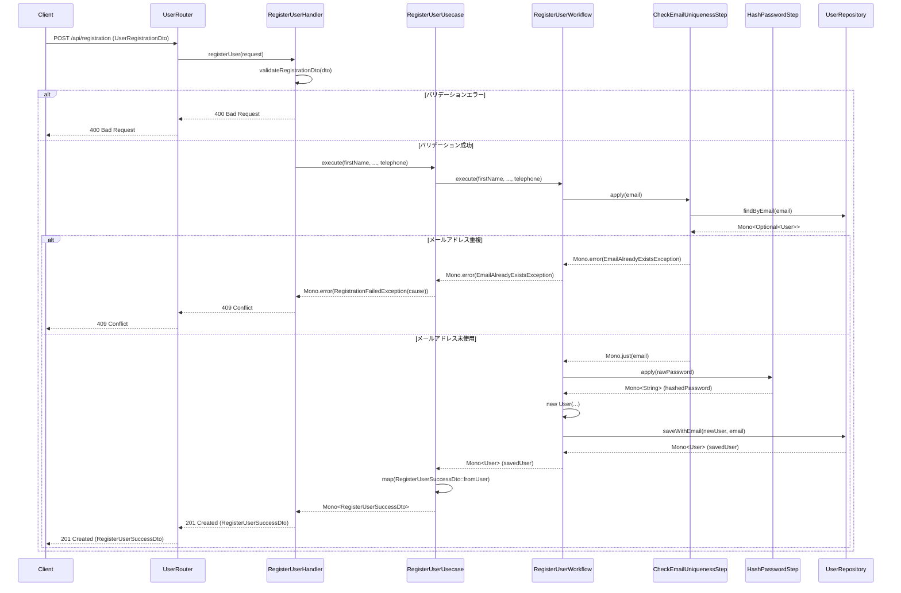

# レビューレポート: ユーザー登録機能の実装

## 1. レビュー対象

現在ステージングされている変更（主にユーザー登録機能 `/api/registration` の実装）をレビューしました。
関連するドメインロジック、アプリケーションロジック、インフラストラクチャ、インターフェース、およびテストコードが含まれます。

## 2. 全体評価

**全体的に良好:**

*   ユーザー登録機能は、リアクティブプログラミング (Spring WebFlux, Project Reactor)、ドメイン駆動設計の要素（ステップ、ワークフロー）、依存性注入などの原則に従って概ね適切に実装されています。
*   `LoginWorkflow` におけるリポジトリ依存性の修正（具象クラスからインターフェースへ）は良いリファクタリングです。
*   セキュリティ設定（登録エンドポイントの認証除外）は適切です。
*   テストは単体テスト（Mockito, StepVerifier）および結合テスト（Testcontainers, WebTestClient）でカバーされており、品質確保への意識が見られます。

ただし、いくつかの改善点と確認事項があります。詳細は後述します。

## 3. ファイル別レビュー詳細

### 3.1. account モジュール

*   **`domain/workflow/LoginWorkflow.java`**
    *   **OK:** 依存する `UserRepository` の型を具象クラスからインターフェースに変更。依存性逆転の原則 (DIP) に従っており、疎結合化に貢献しています。
*   **`infrastructure/config/SecurityConfig.java`**
    *   **OK:** 新しい登録エンドポイント `/api/registration` を認証不要パス (`permitAll()`) に追加。ユーザー登録フローとして妥当です。

### 3.2. model パッケージ

*   **`model/RegisterUserDto.java`**
    *   **要確認/削除候補:** ステージングされていますが、ハンドラーやテストでは `model.UserRegistrationDto` が使用されています。おそらく不要な重複ファイルです。`UserRegistrationDto` に統一し、このファイルは削除することを推奨します。
    *   **(参考: `UserRegistrationDto` について)**
        *   **OK:** ユーザー登録に必要なフィールドを持っています。
        *   **OK:** `validateRegistrationDto` メソッドで確認用パスワードの一致チェックが含まれています。
        *   **改善提案:** バリデーションは Bean Validation API (`jakarta.validation.constraints.*`) を使用する方が Spring Boot では標準的で効率的です。

### 3.3. share モジュール

*   **`infrastructure/security/SecurityConfig.java`**
    *   **要確認/削除候補:** 空ファイルであり、`account` モジュールに実体があるため不要と思われます。削除を推奨します。

### 3.4. user モジュール

#### 3.4.1. application 層

*   **`application/usecase/RegisterUserUsecase.java`**
    *   **OK:** ユースケースとして適切な責務（入力受け取り、ワークフロー委譲、結果マッピング、エラーラップ）を果たしています。
    *   **OK:** ドメインワークフローへの委譲、リアクティブなエラーハンドリング (`onErrorMap`) も適切です。
    *   **OK:** 成功レスポンス用 DTO (`RegisterUserSuccessDto`)、カスタム例外 (`RegistrationFailedException`) の定義も適切です。

#### 3.4.2. domain 層

*   **`domain/repository/UserRepository.java`**
    *   **OK:** `findByEmail`, `save` メソッドは標準的です。
    *   **要検討/改善提案:** `saveWithEmail(User user, String email)` メソッドは、`User` ドメインモデルに email がないための追加と思われますが、ドメイン層のインターフェースとしてはインフラ層の都合に引きずられている可能性があります。代替案（`User` に email を含める、ワークフロー層で `UserDocument` を組み立てるなど）の検討の余地があります。
*   **`domain/step/CheckEmailUniquenessStep.java`**
    *   **OK:** メールアドレス一意性チェックのステップを関数型インターフェースとして定義。責務が明確です。
*   **`domain/step/HashPasswordStep.java`**
    *   **OK:** パスワードハッシュ化のステップを関数型インターフェースとして定義。責務が明確です。
*   **`domain/workflow/RegisterUserWorkflow.java`**
    *   **OK:** ユーザー登録のドメインロジック（一意性チェック → ハッシュ化 → 保存）をリアクティブに構成。
    *   **OK:** 依存ステップ・リポジトリの注入、カスタム例外 (`EmailAlreadyExistsException`) の定義も適切です。
    *   **関連事項:** `userRepository.saveWithEmail` を使用しています（上記リポジトリの指摘参照）。

#### 3.4.3. infrastructure 層

*   **`infrastructure/repository/impl/MongoUserRepositoryExtImpl.java`**
    *   **OK:** Spring Data 標準外の機能 (`saveWithEmail` のロジック）を実装する拡張クラスとして適切です。
    *   **OK:** ドメインモデル (`User`) とデータモデル (`UserDocument`) のマッピング責務を果たしています。
*   **`infrastructure/repository/impl/UserRepositoryImpl.java`**
    *   **OK:** `UserRepository` インターフェースを実装し、Spring Data リポジトリと拡張実装を組み合わせています。
    *   **懸念点/改善提案:** `save` メソッドが既存ユーザー更新時に email を空文字列 `""` で上書きする可能性があります。更新を扱う場合は、既存ドキュメントを取得・マージする実装に変更するか、`save` の責務を明確化（例: 新規作成不可）すべきです。
*   **`infrastructure/stepimpl/CheckEmailUniquenessStepImpl.java`**
    *   **OK:** `CheckEmailUniquenessStep` インターフェースを正しく実装。`UserRepository` を使用し、結果を適切に処理（成功時は email、重複時は `EmailAlreadyExistsException`）しています。
*   **`infrastructure/stepimpl/HashPasswordStepImpl.java`**
    *   **OK:** `HashPasswordStep` インターフェースを正しく実装。Spring Security の `PasswordEncoder` を使用し、`Mono.fromCallable` でリアクティブにラップしています。

#### 3.4.4. interfaces 層

*   **`interfaces/CreateUserController.java`**
    *   **要確認/削除候補:** 空ファイルであり、`UserRouter` と `RegisterUserHandler` が存在するため不要と思われます。削除を推奨します。
*   **`interfaces/dto/CreateUserRequest.java`**
    *   **要確認/削除候補:** 空ファイルであり、`model.UserRegistrationDto` が使用されているため不要と思われます。削除を推奨します。
*   **`interfaces/dto/CreateUserResponse.java`**
    *   **要確認/削除候補:** 空ファイルであり、`RegisterUserUsecase.RegisterUserSuccessDto` が使用されているため不要と思われます。削除を推奨します。
*   **`interfaces/handler/RegisterUserHandler.java`**
    *   **OK:** ハンドラーとしてリクエスト処理、バリデーション、ユースケース呼び出し、レスポンス/エラーハンドリングの責務を果たしています。
    *   **OK:** エラーハンドリング、ロギングも適切です。
    *   **要確認/改善提案:**
        *   使用している DTO (`UserRegistrationDto`) とステージングされた `RegisterUserDto` の不整合。
        *   手動バリデーション (`validateRegistrationDto`) の代わりに Bean Validation の利用を推奨。
        *   `handleRegistration` メソッドの必要性の確認。
*   **`interfaces/router/UserRouter.java`**
    *   **OK:** WebFlux Functional スタイルでの `/api/registration` への POST ルーティング設定として適切です。

### 3.5. テストコード

*   **`user/application/usecase/RegisterUserUsecaseTest.java` (単体テスト)**
    *   **OK:** 依存ワークフローをモック化し、ユースケースのロジック（呼び出し、マッピング、エラーラップ）を検証。正常系・異常系をカバー。Mockito, StepVerifier の使用も適切。
*   **`user/domain/workflow/RegisterUserWorkflowTest.java` (単体テスト)**
    *   **OK:** 依存ステップ・リポジトリをモック化し、ワークフローのロジック（ステップ連携、ユーザー生成、リポジトリ呼び出し）を検証。正常系・異常系をカバー。
    *   **改善提案:** `@MockitoSettings(strictness = Strictness.LENIENT)` の必要性を確認し、より厳格な設定を検討。
*   **`user/interfaces/handler/RegisterUserHandlerIntegrationTest.java` (結合テスト)**
    *   **OK:** Testcontainers で MongoDB を起動し、API エンドポイントの動作を DB 連携含めて検証。テストデータの準備・クリーンアップも適切。正常系・異常系（バリデーション、重複）をカバー。
    *   **改善提案:** テストガイドラインに従い `@Slow` アノテーションの付与を推奨。

## 4. 指摘事項・改善提案サマリー

1.  **不要ファイルの削除:** 上記「要確認/削除候補」とマークされた5つのファイル。
2.  **バリデーション方法の改善:** `RegisterUserHandler` の手動バリデーションを Bean Validation に置き換える。
3.  **`UserRepository.save` の実装見直し:** 既存ユーザー更新時のメールアドレス上書きリスクへの対応。
4.  **`RegisterUserHandler.handleRegistration` の必要性確認:** 不要であれば削除。
5.  **Mockito Strictness 設定:** `RegisterUserWorkflowTest` で `LENIENT` 以外の設定を検討。
6.  **テストアノテーション:** `RegisterUserHandlerIntegrationTest` に `@Slow` を付与。

## 5. シーケンス図 (ユーザー登録フロー)

