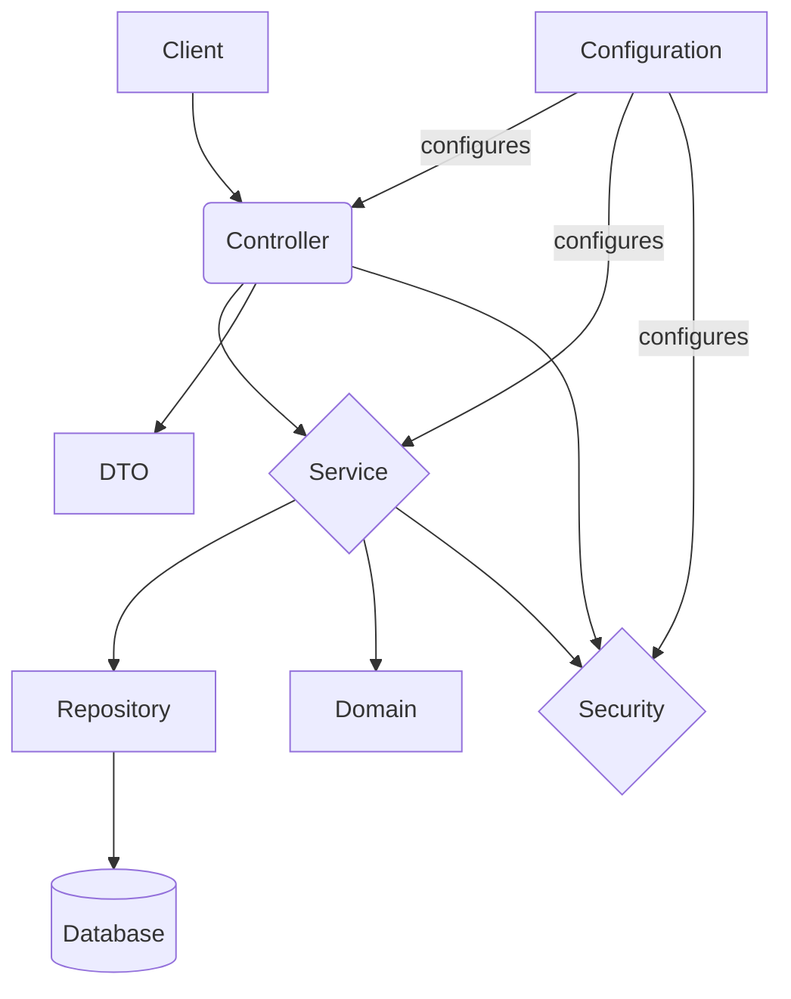
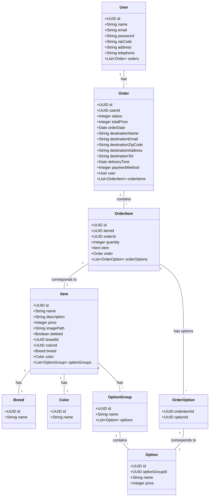
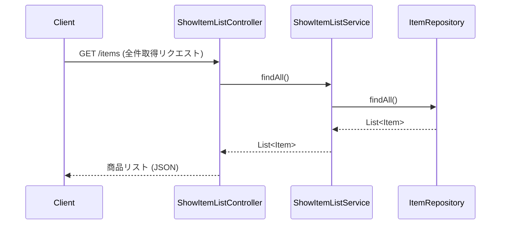
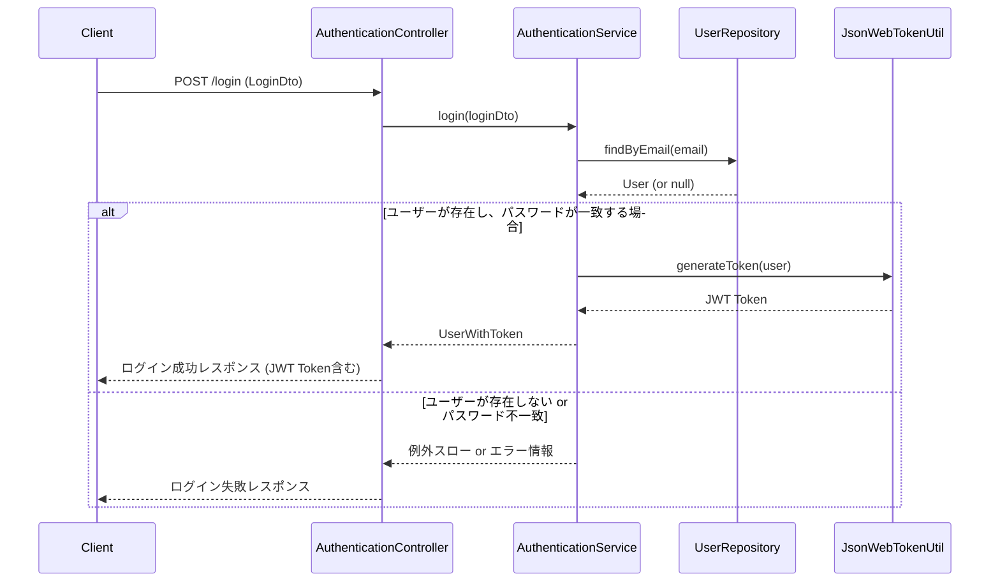
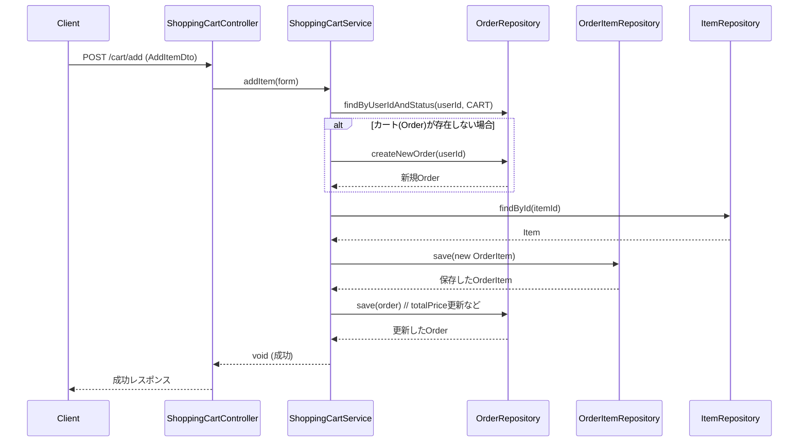
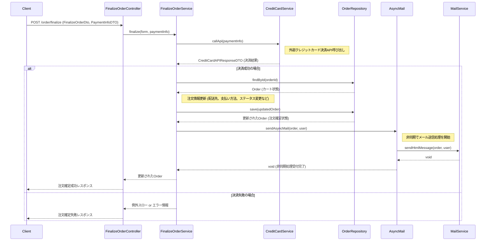

# 概要設計書

## 1. 概要
このドキュメントは、ペットショップECサイトのバックエンドシステムの概要設計を記述します。

## 2. システム構成
Spring Boot をベースとしたMVCアーキテクチャを採用しています。主要なコンポーネントとその役割は以下の通りです。
- **Controller:** HTTPリクエストを受け付け、Serviceを呼び出し、レスポンスを返却します。
- **Service:** ビジネスロジックを実装します。Repositoryを介してデータアクセスを行います。
- **Repository:** データベースへのアクセス（CRUD操作）を担当します。
- **Domain:** アプリケーションの核となるデータ構造（エンティティ）を定義します。
- **DTO:** ControllerとView（または外部システム）間のデータ転送に使用します。
- **Security:** 認証・認可を担当します (JWTを使用)。
- **Configuration:** アプリケーションの設定（非同期処理、メール送信など）を行います。

## 3. 機能一覧
本システムが提供する主要な機能は以下の通りです。

- **認証機能:**
    - ログイン (`AuthenticationController`, `AuthenticationService`)
- **ユーザー管理機能:**
    - ユーザー登録 (`CreateUserController`, `CreateUserService`)
    - ユーザー情報取得 (`UserInfoController`, `UserInfoService`)
- **商品表示機能:**
    - 商品一覧表示 (ページング、検索含む) (`ShowItemListController`, `ShowItemListService`)
    - 商品詳細表示 (`ShowItemDetailController`, `ShowItemDetailService`)
    - 商品画像表示 (`SourceController`, `ImageService`)
- **ショッピングカート機能:**
    - カート内表示 (`ShoppingCartController`, `ShoppingCartService`)
    - 商品追加 (`ShoppingCartController`, `ShoppingCartService`)
    - 商品削除 (`ShoppingCartController`, `ShoppingCartService`)
    - 未ログイン時のカート情報引き継ぎ (`ShoppingCartService`)
- **注文機能:**
    - 注文内容確認 (`OrderConfirmationController`, `OrderConfirmationService`) - ※ 実装詳細要確認
    - 注文確定 (クレジットカード決済連携含む) (`FinalizeOrderController`, `FinalizeOrderService`, `CreditCardService`)
    - 注文完了メール送信 (非同期) (`AsyncMail`, `MailService`)
- **その他:**
    - 初期データ投入 (`DataInitializer`)

## 4. データモデル
主要なエンティティとその概要は以下の通りです。（詳細はクラス図またはソースコードを参照）

- **User:** 顧客情報
- **Item:** 商品情報 (ペット)
- **Breed:** 品種情報
- **Color:** 色情報
- **OptionGroup:** オプショングループ (例: ワクチン)
- **Option:** オプション (例: 接種済み)
- **Order:** 注文情報
- **OrderItem:** 注文明細情報
- **OrderStatus:** 注文ステータス (Enum)
- **DeliveryTimeRange:** 配達時間帯情報
- **TimeRange:** 時間帯 (Enum)

*(注: OrderOption は関連を示すための中間テーブル的なクラスとして表現)*

## 5. シーケンス（主要機能）
主要な機能の処理フローを記述します。

### 5.1. 商品一覧表示 (検索なし、ページングなし)

### 5.2. ユーザーログイン

### 5.3. カートに商品を追加

### 5.4. 注文確定

---
*(シーケンス図は代表的な機能のみ記載。他の機能についても同様に記述可能)*
