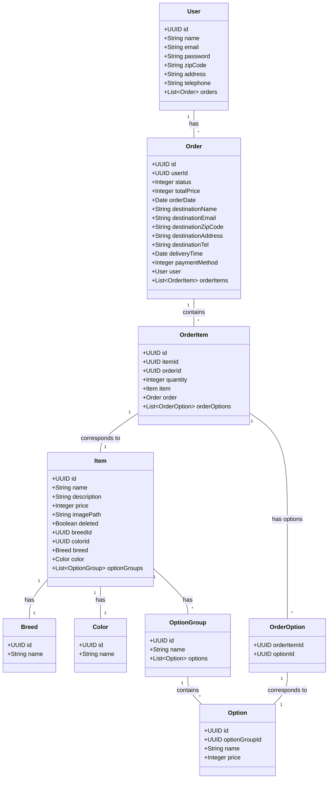
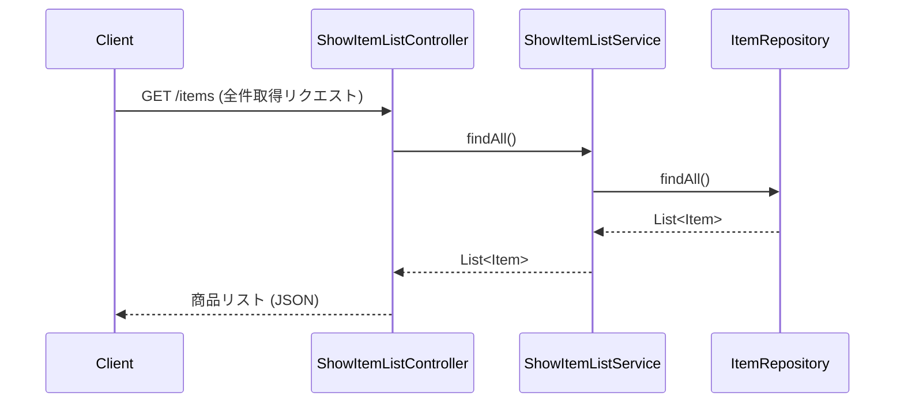
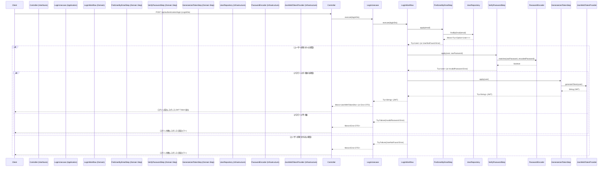
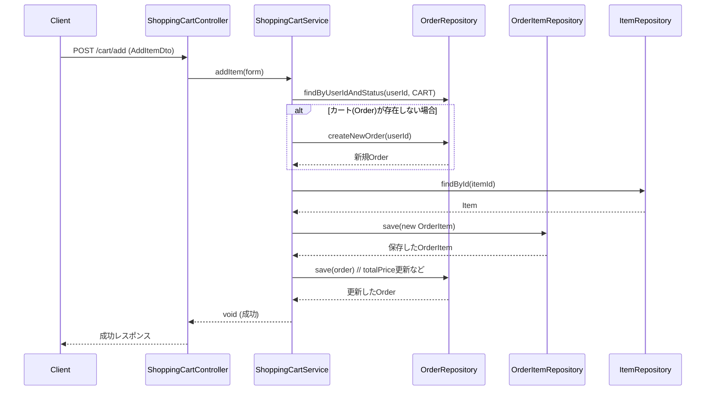
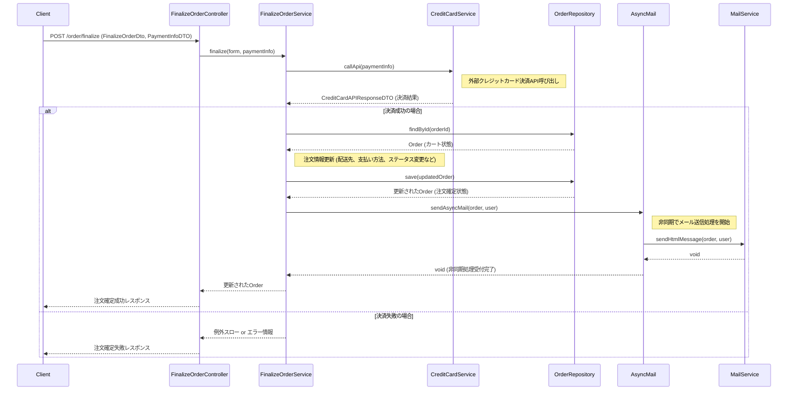

# 概要設計書

## 1. 概要
このドキュメントは、ペットショップECサイトのバックエンドシステムの概要設計を記述します。

## 2. システム構成
Spring Boot (WebFlux) をベースとし、クリーンアーキテクチャ/ヘキサゴナルアーキテクチャの考え方を取り入れたレイヤー構造を採用しています。詳細は `docs/ai/04_ARCHITECTURE.md` を参照してください。主要なレイヤーと役割は以下の通りです。

- **Interfaces (Adapter) 層:** 外部とのインターフェース (REST API Controller など)。
- **Application 層:** ユースケースの実装 (`Usecase` クラス)。
- **Domain 層:** コアビジネスロジック (エンティティ、値オブジェクト、`Workflow`, `Step`)。
- **Infrastructure 層:** 技術的詳細 (DBアクセス、外部連携、セキュリティ実装など)。

```mermaid
graph TD
    A[Client] --> B(Interfaces: Controller);
    B --> C{Application: Usecase};
    C --> E{Domain: Workflow/Step};
    E --> F[Domain: Model];
    C --> G[Infrastructure: Repository];
    G --> H[(Database)];
    C --> I[Infrastructure: Security];
    J[Infrastructure: Configuration] -- configures --> B;
    J -- configures --> C;
    J -- configures --> G;
    J -- configures --> I;
    B --> K[DTO (Generated)];
```
*(図は簡略化されています)*

## 3. 機能一覧
本システムが提供する主要な機能と、関連する主な Application 層の Usecase は以下の通りです。

- **認証機能:**
    - ログイン (`LoginUsecase`)
- **ユーザー管理機能:**
    - ユーザー登録 (`RegisterUserUsecase`)
    - ユーザー情報取得 (`GetUserInfoUsecase`)
- **商品表示機能:**
    - 商品一覧表示 (ページング、検索含む) (`SearchItemsUsecase`, `GetItemListUsecase`)
    - 商品詳細表示 (`GetItemDetailUsecase`)
    - 商品画像表示 (`GetImageUsecase`)
- **ショッピングカート機能:**
    - カート内表示 (`GetShoppingCartUsecase`)
    - 商品追加 (`AddItemToCartUsecase`)
    - 商品削除 (`RemoveItemFromCartUsecase`)
    - 未ログイン時のカート情報引き継ぎ (関連Usecase内で考慮)
- **注文機能:**
    - 注文内容確認 (`ConfirmOrderUsecase`) - ※ 実装詳細要確認
    - 注文確定 (クレジットカード決済連携含む) (`FinalizeOrderUsecase`)
    - 注文完了メール送信 (非同期) (`SendOrderConfirmationMailUsecase` - `FinalizeOrderUsecase` から非同期呼び出し)
- **その他:**
    - 初期データ投入 (`InitializeDataUsecase`)

*(注: 上記は代表的なUsecaseであり、実際のクラス名や粒度は実装時に変更される可能性があります)*

## 4. データモデル
主要なエンティティとその概要は以下の通りです。（詳細はクラス図またはソースコードを参照）

- **User:** 顧客情報
- **Item:** 商品情報 (ペット)
- **Breed:** 品種情報
- **Color:** 色情報
- **OptionGroup:** オプショングループ (例: ワクチン)
- **Option:** オプション (例: 接種済み)
- **Order:** 注文情報
- **OrderItem:** 注文明細情報
- **OrderStatus:** 注文ステータス (Enum)
- **DeliveryTimeRange:** 配達時間帯情報
- **TimeRange:** 時間帯 (Enum)


*(注: OrderOption は関連を示すための中間テーブル的なクラスとして表現)*

## 5. シーケンス（主要機能）
主要な機能の処理フローを記述します。

### 5.1. 商品一覧表示 (検索なし、ページングなし)



### 5.2. ユーザーログイン


*(注: エラーハンドリングや具体的なDTO名は簡略化しています)*

### 5.3. カートに商品を追加



### 5.4. 注文確定



---
*(シーケンス図は代表的な機能のみ記載。他の機能についても同様に記述可能)*
